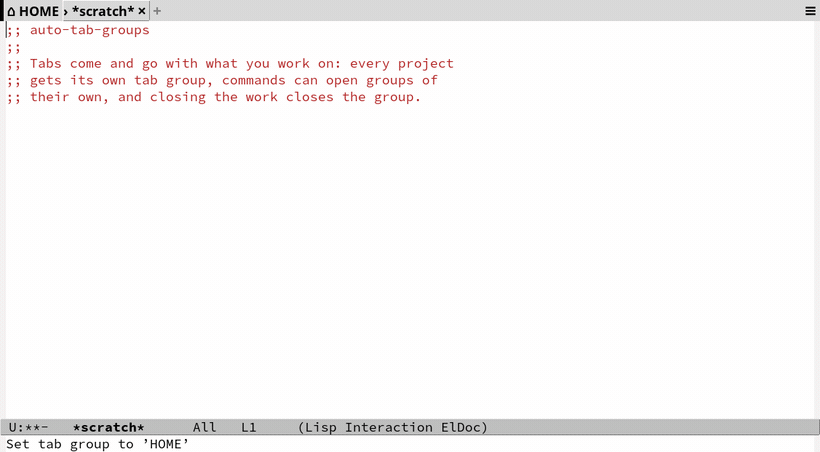

# Inspired by: https://github.com/othneildrew/Best-README-Template
#+OPTIONS: toc:nil

[[https://github.com/MArpogaus/auto-tab-groups/graphs/contributors][https://img.shields.io/github/contributors/MArpogaus/auto-tab-groups.svg?style=flat-square]]
[[https://github.com/MArpogaus/auto-tab-groups/network/members][https://img.shields.io/github/forks/MArpogaus/auto-tab-groups.svg?style=flat-square]]
[[https://github.com/MArpogaus/auto-tab-groups/stargazers][https://img.shields.io/github/stars/MArpogaus/auto-tab-groups.svg?style=flat-square]]
[[https://github.com/MArpogaus/auto-tab-groups/issues][https://img.shields.io/github/issues/MArpogaus/auto-tab-groups.svg?style=flat-square]]
[[https://github.com/MArpogaus/auto-tab-groups/blob/main/COPYING][https://img.shields.io/github/license/MArpogaus/auto-tab-groups.svg?style=flat-square]]
[[https://github.com/MArpogaus/auto-tab-groups/actions/workflows/test.yml][https://img.shields.io/github/actions/workflow/status/MArpogaus/auto-tab-groups/test.yml.svg?branch=main&label=tests&style=flat-square]]
[[https://linkedin.com/in/MArpogaus][https://img.shields.io/badge/-LinkedIn-black.svg?style=flat-square&logo=linkedin&colorB=555]]

* auto tab groups :TOC_3_gh:noexport:
  - [[#about-the-project][About The Project]]
  - [[#getting-started][Getting Started]]
    - [[#prerequisites][Prerequisites]]
    - [[#installation][Installation]]
    - [[#minimal-configuration][Minimal Configuration]]
    - [[#complete-configuration][Complete Configuration]]
  - [[#usage][Usage]]
  - [[#customization][Customization]]
    - [[#auto-tab-groups][auto-tab-groups]]
    - [[#auto-tab-groups-project][auto-tab-groups-project]]
    - [[#auto-tab-groups-eyecandy][auto-tab-groups-eyecandy]]
  - [[#comparison-with-other-packages][Comparison with Other Packages]]
  - [[#how-it-works][How It Works]]
  - [[#contributions][Contributions]]
  - [[#license][License]]
  - [[#contact][Contact]]
  - [[#acknowledgments][Acknowledgments]]

** About The Project

This package puts your work into tab groups.  You give it a list of
commands, and it creates a tab group when you call one of them.  It
closes a tab group when you call a command from a second list.

The package is a thin layer on the tab bar of Emacs.  =tab-bar.el=
does the work, and the [[https://www.gnu.org/software/emacs/manual/html_node/emacs/Tab-Bars.html][manual]] describes its commands.  An optional
mode styles the tab bar.  The package leaves the other tab bar
settings to you.

The picture below shows the example configuration in this file:

Each project gets a tab group of its own.  A command can open a group
of its own.  The group closes when you close the work.

** Getting Started

*** Prerequisites

- Emacs 29.1 or later, with =tab-bar.el= and =project.el=.
- [[https://github.com/rainstormstudio/nerd-icons.el][nerd-icons]] for the icons of the eyecandy mode.  This package is
  optional.

*** Installation

Install from MELPA with the package manager of Emacs:

#+begin_src emacs-lisp
  (use-package auto-tab-groups
    :ensure t)
#+end_src

You can also install by hand:

1. Download =auto-tab-groups.el=, =auto-tab-groups-project.el= and
   =auto-tab-groups-eyecandy.el=.
2. Put the files into your =load-path=.
3. Add these lines to your init file:

   #+begin_src emacs-lisp
     (require 'auto-tab-groups)
     (auto-tab-groups-mode 1)
   #+end_src

*** Minimal Configuration

Each project gets a tab group, and one mode gives you the modern tab
style.  The picture above shows this configuration:

#+begin_src emacs-lisp
  (use-package auto-tab-groups
    :ensure t
    :init
    ;; A tab group for each project, made by `project-switch-project'.
    (auto-tab-groups-project-mode)
    ;; The modern tab style.  The icons come from nerd-icons, if you
    ;; have it.  Plain strings also work:
    ;; (auto-tab-groups-eyecandy-icons '(("HOME" . "⌂")))
    (auto-tab-groups-eyecandy-mode)
    (auto-tab-groups-mode))
#+end_src

Switch to a project with =C-x p p=, and its tab group appears.  Kill
the buffers of the project with =C-x p k=, and the group closes.

If you do not use the eyecandy mode, add the groups to
=tab-bar-format=.  The tab bar then shows them:

#+begin_src emacs-lisp
  (setq tab-bar-format '(tab-bar-format-tabs-groups
                         ;; ... your other format functions
                         ))
#+end_src

*** Complete Configuration

The configuration below adds rules for other commands, icons for the
groups, and a shorter name for a project group:

#+begin_src emacs-lisp
  (use-package auto-tab-groups
    :straight (:host github :repo "MArpogaus/auto-tab-groups")
    :after tab-bar project nerd-icons
    :custom
    ;; Make a tab group for denote, dirvish and customize buffers.
    (auto-tab-groups-create-commands
     '(((denote-create-note denote-menu-list-notes
         consult-denote-find consult-denote-grep) . "denote")
       ((custom-buffer-create-internal) . "customize")
       ((dirvish dirvish-fd) . "dirvish")))
    (auto-tab-groups-close-commands
     '((dirvish-quit "dirvish" :ignore-result t)
       (Custom-buffer-done "customize" :ignore-result t)))
    ;; The height of the tabs.
    (auto-tab-groups-eyecandy-tab-height 25)
    ;; The icons of the groups.  These need nerd-icons.
    (auto-tab-groups-eyecandy-icons
     '(("HOME"       . (:style "suc" :icon "custom-emacs"))
       ("dirvish"    . (:style "suc" :icon "custom-folder_oct"))
       ("denote"     . (:style "md"  :icon "notebook_edit"))
       ("customize"  . (:style "cod" :icon "settings"))
       ("^\\[P\\] *" . (:style "oct" :icon "repo"))
       ("^\\[T\\] *" . (:style "cod" :icon "remote"))))
    ;; Remove the prefix from the name of a project group.
    (auto-tab-groups-eyecandy-tab-bar-group-name-format-function
     (lambda (tab-group-name)
       (if (string-match "^\\[.\\] *" tab-group-name)
           (substring tab-group-name (match-end 0))
         tab-group-name)))
    :bind
    ("<your-binding>" . auto-tab-groups-new-group)
    :init
    (auto-tab-groups-project-mode)
    (auto-tab-groups-eyecandy-mode)
    (auto-tab-groups-mode)
    :hook
    ;; The eyecandy mode needs a restart after `tab-bar-mode' goes off.
    (tab-bar-mode . auto-tab-groups-eyecandy-mode))
#+end_src

** Usage

The package keeps your tasks apart with the groups of the tab bar.

A command in =auto-tab-groups-create-commands= makes a new group, or
switches to the group if it is there.  A command in
=auto-tab-groups-close-commands= closes the group and each tab in it.

The package has one command of its own,
=auto-tab-groups-new-group=.  It makes a new group.  All other
commands for tabs and groups come from =tab-bar.el=.  The package
stays small on purpose.

** Customization

*** auto-tab-groups

| Option                             | Type     | Description                                     |
|------------------------------------+----------+-------------------------------------------------|
| =auto-tab-groups-create-commands=    | alist    | the commands that make a group or switch to one |
| =auto-tab-groups-close-commands=     | alist    | the commands that close a group                 |
| =auto-tab-groups-new-choice=         | multiple | what happens when a new tab appears             |
| =auto-tab-groups-initial-group-name= | string   | the name of the first group                     |
| =auto-tab-groups-before-create-hook= | hook     | runs before the package makes a group           |
| =auto-tab-groups-after-create-hook=  | hook     | runs after the package makes a group            |
| =auto-tab-groups-before-delete-hook= | hook     | runs before the package deletes a group         |
| =auto-tab-groups-after-delete-hook=  | hook     | runs after the package deletes a group          |

=auto-tab-groups-echo-mode= prints a message in the echo area for
each group that the package makes, switches to or closes.

Each entry of =auto-tab-groups-create-commands= and
=auto-tab-groups-close-commands= has two parts:

- CAR: one command, or a list of commands.
- CDR: the name of the group, or a function that returns the name, or
  a plist with the keys =:tab-group-name= and =:ignore-result=.

For a create command the package runs the command first and gives the
result to the name function.  With =:ignore-result= it makes the
group first, and calls the name function with no argument.

For a close command the package closes the group if the command
returns a value.  With =:ignore-result= it closes the group in each
case.

*** auto-tab-groups-project

This mode works together with =project.el=, in the way of
[[https://github.com/fritzgrabo/project-tab-groups][project-tab-groups.el]].  Turn it on:

#+begin_src emacs-lisp
  (auto-tab-groups-project-mode)
#+end_src

Each project then gets a tab group with the name of the project.  The
package makes the group when you switch to the project.
=project-kill-buffers= closes it.

The name comes from =auto-tab-groups-project-group-name=.  You can
also use this function in your own rules.  It takes what the command
returned: a directory, a buffer or the name of a known project.  The
mode has no options of its own.

*** auto-tab-groups-eyecandy

=auto-tab-groups-eyecandy-mode= styles the tab bar.

| Option                                                      | Type          | Description                             |
|-------------------------------------------------------------+---------------+-----------------------------------------|
| =auto-tab-groups-eyecandy-icons=                              | alist         | the icon for each group name            |
| =auto-tab-groups-eyecandy-tab-height=                         | number        | the height of a tab in pixels           |
| =auto-tab-groups-eyecandy-default-icon=                       | string, plist | the icon for a group without a match    |
| =auto-tab-groups-eyecandy-tab-bar-format=                     | list          | the elements of the tab bar             |
| =auto-tab-groups-eyecandy-tab-bar-group-name-format-function= | function      | a function that changes the group name  |

Each entry of =auto-tab-groups-eyecandy-icons= has two parts:

- CAR: a regular expression for the name of the group.
- CDR: a string, or a specification for nerd-icons.  A specification
  is a plist with the keys =:style= and =:icon=, and it needs
  [[https://github.com/rainstormstudio/nerd-icons.el][nerd-icons]].

The first entry that matches wins.  An icon that the frame cannot
draw falls back to a plain character.

** Comparison with Other Packages

- [[https://github.com/mclear-tools/tabspaces][tabspaces]] uses the tab bar and =project.el= to make workspaces with
  their own buffers.
- [[https://github.com/fritzgrabo/project-tab-groups][project-tab-groups]] manages tab groups for projects only.  Use it if
  you want projects and nothing more.
- [[https://github.com/alphapapa/activities.el][activities]] manages frames, tabs, windows and buffers by their
  purpose.

** How It Works

[[file:docs/implementation.org][docs/implementation.org]] describes the implementation: the advice
around your commands, the way the package finds a group, and how the
eyecandy mode draws the tab bar.

** Contributions

Contributions are greatly appreciated!  Feel free to check the
[[https://github.com/MArpogaus/auto-tab-groups/issues][issues page]] or submit a [[https://github.com/MArpogaus/auto-tab-groups/pulls][pull request]].

** License

Distributed under the [[file:COPYING][GPLv3]] License.

** Contact

[[https://github.com/MArpogaus/][Marcel Arpogaus]] - [[mailto:znepry.necbtnhf@tznvy.pbz][znepry.necbtnhf@tznvy.pbz]] (encrypted with [[https://rot13.com/][ROT13]])

Project Link: [[https://github.com/MArpogaus/auto-tab-groups][https://github.com/MArpogaus/auto-tab-groups]]

** Acknowledgments

- Special thanks to [[https://github.com/fritzgrabo][Fritz Grabo]] for the inspiration and the excellent
  [[https://github.com/fritzgrabo/project-tab-groups][project-tab-groups]] package.
